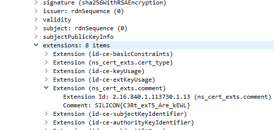
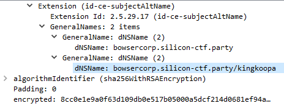
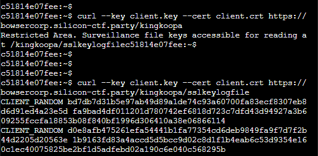

# Level - 9 - TLS Decryption

## Flag 1

Upon opening the PCAP file, using Wireshark in this case, the player can find the flag hidden within the certificate being passed from the Bowser Corp server. 



## Flag 2

Inspecting the server certificate a bit more, the player should find a hint within the Subject Alternative Name extension. A DNS path was added here: /kingkoopa.



At this point the player needs to open the terminal and poke around a bit. There is an Nginx server running within the container, listening on port 443. Upon using curl to make an HTTPS request, the player gets an access denied error. If they looked in their home directory, a client key and cert can be found. Using those credentials with curl will reveal yet another hint from the webserver. Finally, using the sslkeylogfile path, the player will get the contents of ephemeral keys that were written during the packet capture which yielded the pcap file.



```
curl --key client.key --cert client.crt https://
bowsercorp.silicon-ctf.party/kingkoopa/sslkeylogfile
```

The contents of this file will need to be saved to a local file, and loaded into Wireshark. At this point any HTTPS traffic can be decrypted. If http2 is used as a filter, then a single HTTP conversation is found, one of which yields flag 2.


## Flag 3

The last flag takes a little bit of file system poking around. In the /tmp directory is a file: wehavetheprincess.enc. There isn't much too this one, except for trying different things. OpenSSL is installed on the system, which is what was used to encrypt the file. But what key was used? It happens to be the same client certificate found within the home directory. Using OpenSSL and the certificate, decrypting the file looks like this.

```
openssl rsautl -decrypt -inkey certs/client.key -in /tmp/wehavetheprincess.enc -out wehavetheprincess.decrypt
```


